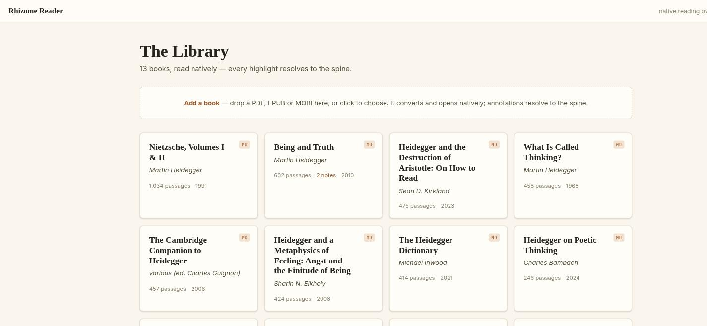
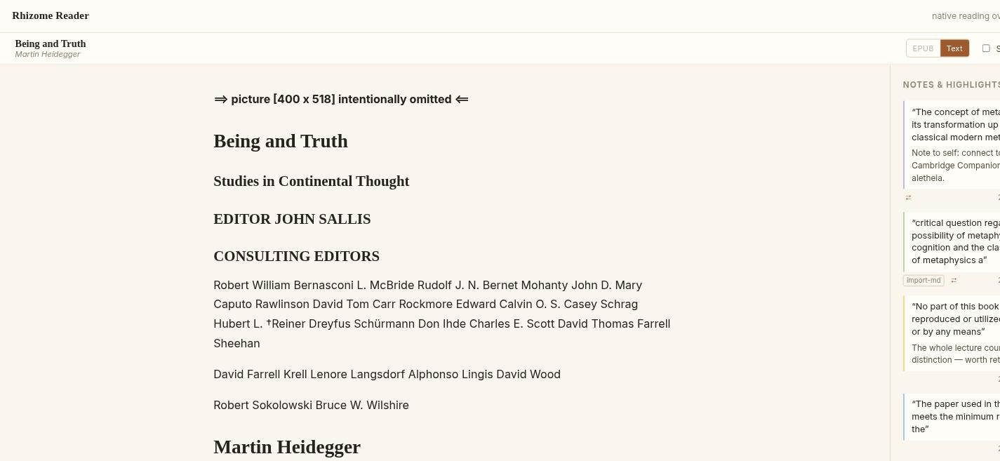
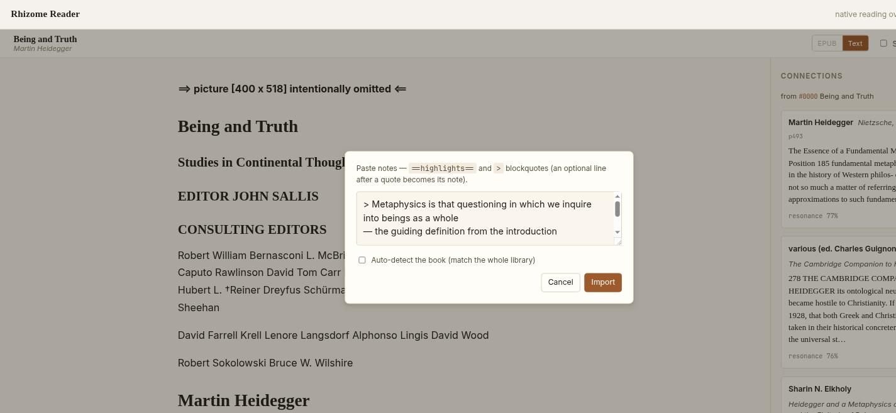
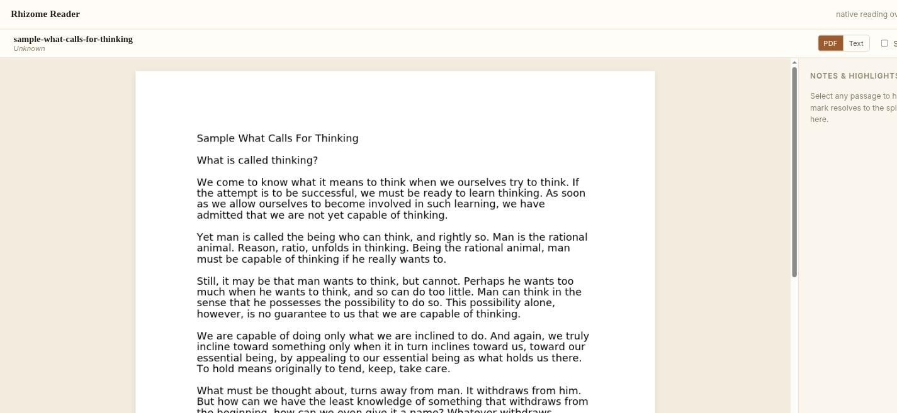
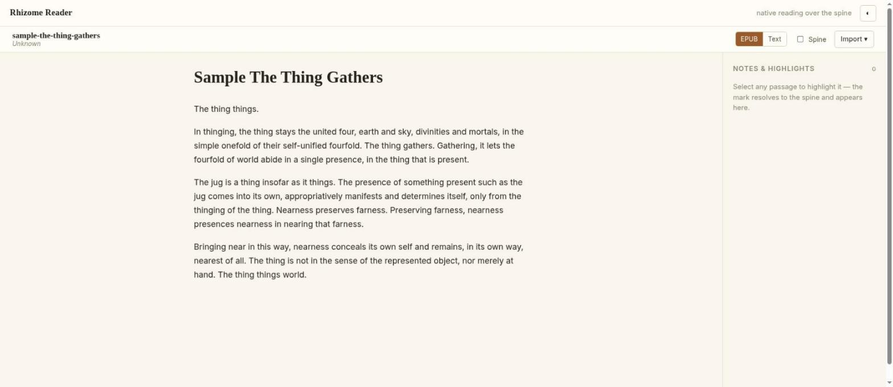
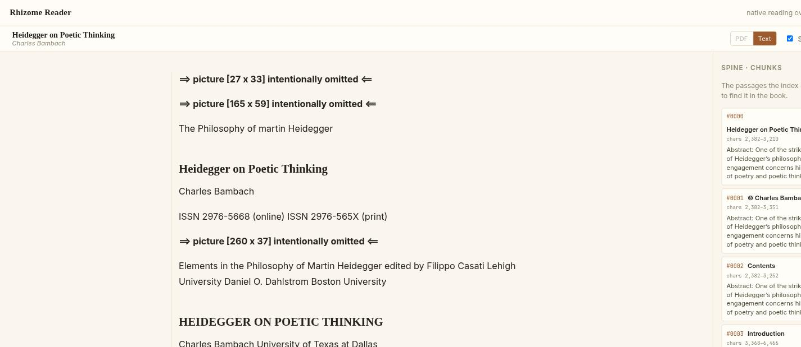

# Rhizome Reader v2 — UI Audit & Design Direction

*Investigation record. Phases 1–2 + Increment 0 (OSS boundary) approved. Implementation proceeds in gated increments; see PART D.*

**Approved decisions (Increment 0):** Adopt Radix (Dialog/Popover/DropdownMenu/Tooltip in Inc 2; Tabs guarded in Inc 4), Floating UI (selection toolbar, Inc 5), Lucide icons. Fonts: **checked-in locally-served WOFF2** (not @fontsource) — Fraunces (display) · Inter (UI/prose) · JetBrains Mono (ids/offsets/scores/metadata), only used weights/subsets, licenses committed beside the assets. Defer react-resizable-panels + TanStack Virtual (profile-gated). Reject React Aria + unified/remark for this pass. Wide-screen marginalia is a separately-gated post-checkpoint enhancement (MD-first, fixtures required).

Identity to serve: **"The book remains a book, while its computational spine remains available beneath it."** A serious reading-and-research instrument — not a SaaS dashboard, not a deck of cards.

---

# PART A — AUDIT (Phase 1)

## A1. Component & route map

**Router** (`src/main.tsx`, `createBrowserRouter`)

| Path | Component | Notes |
|---|---|---|
| `/` | `App` shell → `<Outlet/>` | sticky topbar + `ErrorBoundary` |
| `/` (index) | `routes/Library.tsx` | book grid + upload dropzone |
| `read/:bookId` | `routes/Reader.tsx` | reads `?format=`, `?chunk=` |

**Shell** (`App.tsx`): `.app-shell` → sticky `.topbar` (`brand` "Rhizome Reader" link · spacer · `.muted` tagline "native reading over the spine" · `ThemeToggle` cycling auto→light→dark, icons ◐☀☾, writes `data-theme`, persists to localStorage) → `ErrorBoundary` → `Outlet`.

**Reader tree**
```
Reader (routes/Reader.tsx)
├─ reader-bar: title · format-switch · Spine toggle · ImportMenu
├─ renderer-slot: ONE of  PdfRenderer | EpubRenderer | MdRenderer(→SpineView→BlockView)
├─ right column (mutually exclusive):
│   connChunk ? ConnectionsPanel(→useConnections SSE)
│   : spineView ? SpinePanel
│   : NotesRail(→OrphanRow)
├─ SelectionToolbar   (when anchor set)
├─ reader-flash       (toast)
└─ composer modal     (note compose)
```

**Reachable surfaces (visited live):** Library · Reader loading (`Opening the book…`) · MD reading surface · Notes rail (populated) · Orphan queue · Spine panel · Connections panel (streamed) · Import popover + Markdown modal · Selection toolbar · PDF renderer · EPUB renderer · error/empty states.

## A2. Design language & token inventory

**Sources:** `src/styles/tokens.css` (tokens), `src/styles/global.css` (base/shell/`.btn`/topbar), `src/routes/reader.css` (854 lines — the bulk), `src/routes/library.css`.

**Token set (good bones, keep):** paper/ink ramp (`--paper`, `--paper-raised`, `--paper-sunken`, `--ink`, `--ink-soft`, `--ink-faint`, `--rule`, `--rule-strong`); accent burnt-sienna (`--accent`, `--accent-soft`, `--accent-wash`); highlight palette (`--hl-amber/rose/sage/sky/violet`) + `--approx`; fonts (`--font-display` Fraunces/serif, `--font-body` Inter/sans, `--font-mono` JetBrains/mono); `--measure: 65ch`; `--radius 8 / --radius-sm 5`; `--rail-w 20rem`; `--shadow-1/2`. Light in `:root`, dark duplicated in `@media prefers-color-scheme` **and** `:root[data-theme="dark"]`.

**What's missing / broken at the token layer:**
- **Fonts never load.** `document.fonts.size === 0` — no `@font-face`, no `<link>`, no woff2 anywhere. Fraunces/Inter/JetBrains silently fall back to OS serif/sans/mono. *The intended typographic identity does not currently render.*
- **No type scale.** ~21 hard-coded sizes between 0.62–1.9rem, many 0.02rem apart.
- **No spacing scale.** Dozens of raw rem literals (`0.28`, `0.55`, `1.15`, `1.1` vs `1.25`…); the `--space` token is essentially unused.
- **Dark theme maintained twice** (drift risk).
- **Magic numbers:** `top:3.1rem`, `calc(100vh−3.1rem)`, `calc(--rail-w + 3rem)`, `calc(--measure + 8rem)` (repeated).

## A3. Surface-by-surface problems

**Library** *(fig 01)* — Solid: clean grid, format badge, passages/notes/year. Weak: "Add a book" is a large dashed box competing with content; card shadow + hover-lift reads slightly product-y; grid only survives via `minmax(15rem,1fr)` (no real breakpoints).

**Reading surface (MD)** *(fig 02)* — The strongest surface. Generous measure, good line-height. But headings are OS-serif fallback (not Fraunces); the `⇒ picture […] intentionally omitted ⇐` markers are raw/technical in the reading plane.

**Notes rail** *(fig 02)* — Every mark is a **boxed card** (`--paper-raised` + `1px --rule` + left color rule), stacked. Metadata row crams tag + `⇄` + timestamp + `×` at ~0.66–0.7rem. Reads as a stack of widgets, not marginalia. No hover affordance hierarchy; delete `×` always visible.

**Spine panel** *(fig 07)* — Same boxed-row treatment; each row = mono `#0000` chip + heading + `chars 2,382–3,210` + preview. Dense and legible but heavily bordered; metadata competes with preview. (Also surfaced a data smell: identical char-spans on #0000–#0002.)

**Connections panel** *(fig 03)* — Real value, buried in boxes: each candidate is a bordered card containing author/title, a serif snippet, `resonance 77%` in mono, a genuine chip that *re-declares* its own border. `resonance`/`structural` are text, not a visual meter. Panel width is an ad-hoc `--rail-w + 3rem`.

**Import** *(fig 04)* — Popover menu → centered modal. Functional and clean-ish, but the modal is a tight bordered card; the textarea and help text are cramped; the auto-detect checkbox is an afterthought row.

**PDF renderer** *(fig 05)* — **Theme break:** the PDF.js page is stark #fff floating in the cream `--paper` surround — the one surface that doesn't feel like "the book." Empty rail beside it.

**EPUB renderer** *(fig 06)* — Best-integrated renderer: the iframe is themed to paper/ink, so it reads as one surface. Confirms the target look the PDF surface misses.

**Cross-cutting:**
1. **Box overload** — ~20+ separately bordered surfaces, nested up to 3 levels (rail → card → chip). Everything reads equally weighted → weak hierarchy.
2. **Three button idioms, four hover conventions, no `:focus-visible` anywhere** (accessibility gap).
3. **Massive duplication** — card chrome ×10, ghost-button ×6, left-accent quote block ×3, rail shell ×3, textarea ×2, section label ×2.
4. **Serif misused as small UI body** (connection text, composer quote at 0.9rem) — muddies display-vs-body roles.
5. **Provenance/uncertainty** present (origin tag, dotted `approximate`) but rendered as bordered chips rather than quiet inline marks.

## A4. Functional constraints the redesign MUST preserve

These carry anchoring / scrolling / SSE / rendering / annotation behavior — do not alter their contracts:

- **Anchoring** — `reader/renderer.ts` `AnchorInput{quote,prefix,suffix,locator,rect}`; `reader/anchoring.ts selectionToAnchor` (MD, needs `[data-s]` spine-offset spans in `SpineView`); `PdfRenderer.readSelection` (`{page,quads}`); `EpubRenderer.readSelection/context` (`{cfi}`). `rect` drives toolbar placement.
- **Chunk mapping** — `MdRenderer.chunkAt`, `RendererHandle.locateChunk` (per format), `?chunk=` deep-link effect in `Reader.tsx` (retry `setInterval`).
- **SSE** — `reader/useConnections.ts` EventSource lifecycle (`finished` guard prevents reconnect); named events `seed/candidates/verdicts/exploration/note/error/done`.
- **Scroll-sync** — `reader/useScrollSpy.ts` (capture-phase scroll + rAF `elementFromPoint` probe) + `MdRenderer.probeChunk` + `Reader.onVisibleChunk`; the **memoized `annotated` tree** (perf — must stay memoized).
- **Renderer handle** — `handleRef.current = {jumpToAnnotation, locateChunk}` in each renderer.
- **Annotation CRUD** — `reader/useAnnotations.ts` (optimistic create/remove/pin/dismiss/reload) → `api/client.ts`.
- **Highlight painting** — MD `<mark>` via `SpineView.segmentsFor`; PDF `.pdf-hl` divs from `{page,quads}`; EPUB `Rendition.annotations` at CFI (uses hard-coded `FILL` hex — tokens don't reach the iframe).
- **DOM the logic depends on:** `.reading-surface` + `[data-s]` spans (selection + probe); `.pdf-page[data-page]` + `[data-off]` spans; `.spine-panel` scroll container (active-row auto-scroll).

## A5. Reuse / refactor / introduce / remove

**Reuse (good as-is):** paper/ink/accent tokens, highlight palette, `--shadow-1/2`, `--radius*`, pulse animations, the EPUB iframe-theming approach, the overall Reader orchestration in `Reader.tsx`.

**Refactor (consolidate duplication):** extract single primitives — `card` (→ mostly *delete* boxes), `rail`, button (size/variant), `btn-ghost`, `list-row`, `chip`, `meta-row`, `field/textarea`, section-label. Collapse the 3 rails into one rail surface. Dedupe dark tokens to one source.

**Introduce:** type-scale + spacing-scale + focus-ring + hairline tokens; `@font-face` for Fraunces/Inter/JetBrains (self-hosted woff2, no CDN); a rail **segmented control** (Notes/Spine/Connections); a **resonance meter** primitive; a **Drawer/Sheet** for narrow screens; a bottom-anchored selection action-bar for narrow.

**Remove:** per-element card chrome (replace with rules/whitespace), redundant borders, the unused `api.resolve`/`ResolveResult`/`TocEntry` dead code, magic-number layout constants (tokenize).

## A6. Prioritized plan

1. **Foundation** — vendor fonts (@font-face); add type/space/focus/hairline tokens; dedupe dark theme; delete dead code.
2. **Layout** — one rail with segmented header; tokenize header-height/measure/rail-width; margin-annotation lane on wide viewports.
3. **Components** — de-card notes/spine/connections into typographic list-rows; unify buttons + ghost + chips; resonance meter; quiet provenance marks; single focus ring.
4. **Responsive** — rail → drawer/sheet < ~900px; reading full-width; toolbar → bottom action-bar; modals → sheets; kill fixed-width panel overflow.
5. **States** — consistent loading / empty / error / disabled / hover / focus; PDF page framing to fit the paper theme.
6. **Polish** — motion, spacing rhythm, dark-mode pass, keyboard map.

## A7. Files likely to change

- `src/styles/tokens.css` — type/space/focus/hairline tokens, `@font-face`, dedupe dark.
- `src/styles/global.css` — button/ghost/chip/field primitives, topbar, `center-note`, focus ring.
- `src/routes/reader.css` — the main refactor (de-card, rail unification, responsive, states).
- `src/routes/library.css` — grid/upload polish + breakpoints.
- `frontend/public/fonts/` (new) — Fraunces/Inter/JetBrains woff2.
- Minimal structural JSX (preserve all contracts): `Reader.tsx` (segmented rail header wrapping the *same* three panels), `NotesRail.tsx` / `SpinePanel.tsx` / `ConnectionsPanel.tsx` (className/markup only), `SelectionToolbar.tsx` (narrow bottom-bar variant), `ImportMenu.tsx` (popover/modal styling). Possibly new `reader/Rail.tsx`, `reader/Segmented.tsx`, `reader/Drawer.tsx`, `reader/ResonanceMeter.tsx`.
- **No logic changes:** `renderer.ts`, `useConnections.ts`, `useScrollSpy.ts`, `useAnnotations.ts`, `anchoring.ts`, and the three renderers' selection/paint/handle code.

## A8. Evidence

Desktop captures, real 13-book corpus, 5 seeded annotations on *Being and Truth*.

| # | Surface | Note |
|---|---|---|
| 01 |  | Library grid + upload dropzone. |
| 02 |  | MD reading surface + populated notes rail — note the boxed-card stacking and the `import-md` provenance tag. |
| 03 |  | Streamed cross-book connections — value buried in boxes; `resonance 77%` is text, not a meter. |
| 04 |  | Markdown import modal with auto-detect toggle. |
| 05 |  | PDF.js page — stark white breaks the paper theme (fidelity to preserve; frame the shell instead). |
| 06 |  | EPUB iframe themed to paper/ink — the target integration. |
| 07 |  | Spine · chunks — heavy per-row boxing, mono ids/spans. |

Browser probes confirmed: `document.fonts.size === 0` (no web fonts load); `innerWidth` fixed at 1745 in the automation env (couldn't force a narrow viewport — responsive findings rest on the single `@media(max-width:900px)` in `reader.css:839`, which restacks only `.notes-rail`, leaving `.connections-panel`/`.spine-panel` at fixed width). Two subagents mapped the full component tree and CSS/token inventory.

---

# PART B — DESIGN DIRECTION (Phase 2)

## B1. Visual principles

1. **The text is the figure; the machine is the ground.** The reading column gets contrast, light, serifs, measure. The spine/engine layer recedes — mono, `--ink-faint`, smaller, summoned not omnipresent.
2. **Rules and whitespace, not boxes.** A list of notes is a *list* (hairline-separated rows), not a stack of cards. Reserve borders for genuine inputs and true overlays.
3. **Quiet controls that emerge.** Chrome sits at low contrast; hover/focus brings it forward. The reader-bar is minimal.
4. **One of each system:** one type ramp, one spacing scale, one focus ring, two elevations (popover, modal/drawer).
5. **Honest but restrained provenance/uncertainty.** `approximate` = the existing dotted underline + one small marker; `origin` = a quiet mono word, not a chip.
6. **Functional motion only.** Locate-pulse (keep), 120–160ms hover/focus, 200ms drawer slide; honor `prefers-reduced-motion`.

## B2. Information hierarchy — three planes

- **Plane 1 · the book** — reading serif, 1.15rem/1.7, measure ~62–66ch, `--ink` on `--paper`.
- **Plane 2 · the reader's marks** — highlights inline; notes as **margin marks** (wide) / rail rows (narrow); a color spine (left rule), never a full box.
- **Plane 3 · the spine/engine** — chunks, connections, imports: `--font-mono` metadata, `--ink-soft/faint`, lives in the rail/drawer, invoked on demand.

## B3. Page anatomy

**Desktop (≥ ~1100px)**
```
┌ topbar (slim, sticky): brand · [book title when reading] · theme ┐
├──────────────────────────────────────────────────────────────────┤
│  gutter │        reading column (measure, centered)      │  RAIL  │
│ (margin │   Plane-1 text + inline highlights             │ 1 pane │
│  marks) │                                                │ Notes/ │
│         │                                                │ Spine/ │
│         │                                                │ Conn.  │
└─────────┴────────────────────────────────────────────────┴────────┘
```
- **One rail**, fixed `--rail-w`, hairline `border-left`, with a **segmented header** (Notes · Spine · Connections) replacing today's three differently-sized panels. Same child components, same behavior.
- **Wide (≥ ~1500px):** annotations may surface as **margin marks** in the gutter beside their line (real marginalia), freeing the rail for spine/connections. (Progressive enhancement; rail remains the fallback.)

**Narrow (< ~900px)**
- Reading column full-width, comfortable padding.
- Rail content → **bottom sheet / drawer** summoned by Notes/Spine/Connections controls in the reader-bar (or a slim bottom bar). No fixed-width side panel (fixes today's overflow).
- Selection toolbar → **bottom action-bar**; modals → full-width **sheets**.

## B4. Component inventory (with container justification)

| Element | Container decision | Why |
|---|---|---|
| Reading surface | **unboxed** typographic region | it's the book, not a widget |
| Highlight | inline `<mark>` | part of the text |
| Note | margin mark (wide) / **list-row** with color spine (narrow) | marginalia, not a card |
| Notes list | **hairline-separated rows** | a list is a list |
| Spine chunk | quiet **list-row** (mono id + preview) | index entry, recedes |
| Connection | **list-row**: title/author/page · snippet · resonance meter · quiet "open in book →" | reading result, not a tile |
| Rail | **one rail** (border-left) + segmented header | persistent side context |
| Selection toolbar | **popover** (elevation-1) anchored to `rect`; bottom-bar on narrow | transient, over content |
| Import menu | **popover**; compose step → **modal/sheet** | menu vs. focused task |
| Orphan queue | labeled **section** in Notes rail; candidates = inline disclosure | not nested cards |
| Flash | **toast** (elevation-2), bottom-center | transient status |
| Provenance | inline **mono word** | restraint |
| Resonance/structural | tiny inline **meter** + % (mono) | legible at a glance |

## B5. Type / spacing / color / border / radius / elevation / motion

**Type scale (new tokens):** `--text-xs .75 · --text-sm .8125 · --text-ui .9375 · --text-reading 1.15 · --text-lg 1.25 · --text-xl 1.6 · --text-2xl 2rem`. Line-heights `reading 1.7 · ui 1.4 · tight 1.2`. Weights 400/500/600. **Roles:** display serif → book titles + reading headings only; body sans → all UI chrome; mono → ids, spans, metrics. Stop using serif for small UI body.

**Spacing scale (4px base, new tokens):** `--space-1 .25 · -2 .5 · -3 .75 · -4 1 · -5 1.5 · -6 2 · -8 3rem`. Replace every raw literal.

**Color:** keep the paper/ink/accent set. Add `--rule-hair` (lighter than `--rule`) for separators; use `--rule`/`--rule-strong` only on inputs/overlays. Accent reserved for interactive/among-text emphasis, not decoration. Highlights unchanged.

**Border / radius:** hairline rules for separation; borders only on inputs + overlays. `--radius 8` (overlays/inputs), `--radius-sm 5` (chips/controls).

**Elevation:** exactly two — popover `--shadow-1`, modal/drawer `--shadow-2`. No shadows on list rows or inline content.

**Focus:** one token `--ring` (2px `--accent`, 2px offset) on `:focus-visible` for every interactive element.

**Motion:** 120–160ms ease hover/focus; 200ms drawer slide; keep `pulse`/`pagePulse` for locate; `prefers-reduced-motion` disables non-essential.

## B6. Interaction / state matrix

For each control class — **button, ghost-button, list-row, input, rail-segment, toolbar-action, chip** — define: `default · hover · focus-visible · active · disabled · loading · (row:) selected`. Surface-level states standardized: **loading** (center-note / inline spinner), **empty** (quiet one-line prompt, e.g. Notes "Select a passage to highlight it"), **error** (inline, `--hl-rose` tint, not a raw stack), **disabled** (reduced opacity + `not-allowed`, e.g. format unavailable). Keyboard: `Esc` closes overlays (exists for composer — extend to popover/rail-drawer), `⌘/Ctrl+Enter` saves (exists), rail segments arrow-navigable.

## B7. Implementation increments with verification gates

Each = its own commit. `tsc --noEmit` + build clean after every one; visually inspect changed surfaces (desktop; narrow via emulation where possible); before/after screenshots. **No PR until the whole pass is verified.**

1. **Foundation** — @font-face (self-hosted woff2); type/space/focus/hairline tokens; dedupe dark; remove dead `resolve` types. *Gate:* `document.fonts.size>0` and headings render in Fraunces; reading surface unchanged structurally.
2. **Primitives** — button/ghost/chip/field/list-row/meta-row/section-label + focus ring in global.css; delete `.card` chrome. *Gate:* every surface still renders; zero behavior change.
3. **Reading + annotations** — measure/type refinement; note as list-row/margin-mark; provenance as inline mark; resonance meter. *Gate:* create-highlight still anchors; scroll-sync + `[data-s]` intact.
4. **Rail unification** — one `Rail` + `Segmented` header wrapping the existing Notes/Spine/Connections panels. *Gate:* SpinePanel active-row auto-scroll, ConnectionsPanel SSE stream, NotesRail CRUD + orphan pin/dismiss all intact.
5. **Responsive** — rail→drawer, reading full-width, toolbar→bottom-bar, modals→sheets; remove fixed-width overflow. *Gate:* no horizontal overflow at narrow; behavior parity.
6. **States & polish** — loading/empty/error/disabled/focus sweep; PDF page framing to sit in paper; motion + dark pass. *Gate:* full keyboard + state walkthrough.

---

# PART C — INCREMENT 0: OSS BOUNDARY

**Rule: borrow mechanics, invent meaning.** Commodity mechanics (focus trap, ARIA, keyboard nav, collision-aware popovers, mobile sheets, resizable separators, markdown ASTs, list virtualization) → delegate. Rhizome identity (passage↔spine↔chunk, anchoring/re-anchoring, book⇄spine movement, marginalia semantics, provenance/uncertainty, connections/SSE stages, the book/marks/machine relationship) → stays custom.

**Dependency reality (verified in `frontend/package.json` + `package-lock.json`):** deps are only `react@18.3.1`, `react-dom`, `react-router-dom@6.28`, `epubjs`, `pdfjs-dist@4.10`. **No** primitive/positioning/icon/markdown library exists directly or transitively — no Radix, React Aria, Floating UI, Popper, TanStack, remark, lucide, @fontsource, downshift, headlessui. React is a normal Vite-bundled dep (not a global/CDN); Radix/Floating UI peer-dep `react>=16.8` and dedupe against it. Single bundle, no `manualChunks` (code-splitting renderers was tried and reverted — PDF text-layer instability). So the OSS boundary is greenfield; there is nothing to conflict with, and **no two-primitive-system risk** as long as we pick Radix and *not* React Aria.

### Candidate-by-candidate

**1. Radix Primitives — Dialog, Popover, DropdownMenu, Tooltip, (Tabs), (Toggle/Switch)**
- *Hand-built today:* composer modal (`routes/Reader.tsx` ~L224–257: `.composer-back`/`.composer` — no focus trap, no scroll-lock, no `aria-modal`, no return-focus, Esc only via the textarea's `onKeyDown`); import menu (`reader/ImportMenu.tsx`: `.import-pop`, closes on `onMouseLeave` only, no keyboard nav, no focus mgmt, no robust outside-click); format switch + Spine checkbox (`Reader.tsx` reader-bar).
- *Problem removed:* focus trapping, ARIA roles/labelling/`aria-modal`, Esc + arrow-key + Tab-cycle keyboard nav, outside-click + scroll-lock + return-focus, collision-aware popover placement (Radix bundles `@floating-ui/dom` internally).
- *Compatibility:* headless + **unstyled** — we supply all paper/ink CSS; no visual kit imposed (satisfies "no shadcn/Tailwind"). React 18 native. Per-primitive packages tree-shake.
- *Bundle:* ~40–70KB gz for Dialog+Popover+DropdownMenu+Tooltip combined (shared internals dedupe) — modest beside pdfjs/epubjs already shipped.
- *A11y benefit:* **highest single win** — today's modals/menus are inaccessible.
- *Migration risk:* **LOW** — wraps new chrome around existing content/handlers; touches none of anchoring/SSE/scroll/renderer. Composer keeps its Cmd/Ctrl+Enter save + create flow; ImportMenu keeps `run()`. **Tabs caveat:** the rail segmented header wants Tabs for roving-tabindex/ARIA, but Radix Tabs unmounts inactive panels — that would destroy Connections SSE state on switch. Use Tabs **with `forceMount` + CSS visibility** and keep panel mounting/state ours (constraint #5).
- *Verdict:* **ADOPT NOW** — Dialog, Popover, DropdownMenu, Tooltip (Increment 2). **ADOPT (guarded)** — Tabs for the rail header in Increment 4, behind the forceMount proof. Toggle/Switch — *defer* (checkbox is fine).
- *Proof boundary:* (a) Radix Dialog around the composer preserves Cmd+Enter save / Esc / backdrop-close; (b) Radix Tabs + forceMount preserves an in-flight ConnectionsPanel SSE stream across a Notes→Spine→Connections→back switch.

**2. Floating UI (`@floating-ui/react`) — selection toolbar**
- *Hand-built today:* `reader/SelectionToolbar.tsx` L19–20: `top = max(8, rect.top−46)`, `left = selection center`, `position:fixed`. **No flip (overlaps the selection near the top), no shift (overflows at horizontal edges), no reposition on scroll/zoom.**
- *Problem removed:* `flip`/`shift`/`offset` collision handling + optional `autoUpdate`, from a **virtual reference** built off the existing `anchor.rect` — works uniformly over the MD surface, PDF text layer, and EPUB iframe (rect already normalized to viewport coords by each renderer).
- *Compatibility:* headless positioning; consumes `anchor.rect` unchanged; dedupes `@floating-ui/core/dom` with Radix's copy.
- *Bundle:* ~6–12KB gz on top of Radix's shared core.
- *A11y:* indirect (keeps the toolbar reachable/on-screen).
- *Migration risk:* **LOW** — one-shot placement (selection rect is static post-selection; `autoUpdate` optional). Keep `onMouseDown preventDefault` (holds the selection).
- *Verdict:* **ADOPT** (Increment 5, with the toolbar work). Fixes a real edge-overflow bug.
- *Proof boundary:* selection at the very top (must flip below), at the right edge (must shift in), and inside a scrolled PDF page — stays on-screen and over the selection, across MD/PDF/EPUB.

**3. react-resizable-panels — book/rail split**
- *Hand-built today:* fixed measure-capped reading column + fixed `--rail-w` rail; no resize.
- *Assessment:* long-form reading is **deliberately measure-capped (~65ch)** — a wider reading column is worse, not better; resizing mainly helps the rail want more room for Connections. A draggable separator also fights the "quiet controls" principle, and is moot on narrow (rail→drawer). Low value against the reading goal the user set.
- *Bundle:* ~8KB gz. *A11y:* keyboard-resizable handles (fine).
- *Verdict:* **DEFER/likely reject.** Revisit only if, after the rail redesign, Connections genuinely needs user-widening. Not in the approved passes.

**4. TanStack Virtual — long lists (NOT the book DOM)**
- *Hand-built today:* `SpinePanel` renders **all** `book.paragraphs` (602 for *Being and Truth*, ~1000+ for *Nietzsche*) as DOM rows; `ConnectionsPanel` renders ≤8; orphan list is small.
- *Book DOM:* **REJECT** — the reading surface + `[data-s]` spans must stay fully materialized (selection, anchoring, scroll-sync `elementFromPoint`, highlight painting, open-in-book all require it). The user forbids it and it cannot be proven safe.
- *Connections/orphans:* **REJECT** — too few rows to matter.
- *Spine panel list:* the only real candidate. But the freeze we fixed was the spine-**annotated reading view** (memoized), *not* the panel list, which isn't a proven bottleneck. Virtualizing it would break the active-chunk auto-scroll (active row may be unmounted) — rewireable via `virtualizer.scrollToIndex`, but that changes SpinePanel's tracking contract.
- *Verdict:* **DEFER.** Adopt for the Spine panel *only if* profiling a 1000+-chunk book shows jank, and only with the active-row tracking rewired to `scrollToIndex`.
- *Proof boundary (if later):* virtualized SpinePanel keeps active-chunk auto-scroll + click-to-open on *Nietzsche* (~1000 chunks).

**5. unified/remark — markdown parsing**
- *Two parsers exist:* (a) **backend** `rhizome/imports.py parse_markdown_quotes` (Python) — remark is JS, architecturally can't/shouldn't move to the client (resolver, book-detect, provenance, orphans are server-side). (b) **frontend** `reader/spine.ts parseSpine` — parses the spine markdown into blocks **carrying per-segment `data-s` byte offsets** that anchoring depends on.
- *Assessment:* (a) **REJECT** — wrong layer. (b) mdast exposes `position.offset`, but reconciling remark's offset model with the exact frontmatter-stripped spine string the resolver uses is high-risk; any mismatch silently breaks anchoring — core Rhizome identity the user reserves as custom.
- *Bundle:* unified+remark-parse+mdast ~40–60KB gz.
- *Verdict:* **REJECT** for import parsing; **REJECT (revisit only under proof)** for `parseSpine` — only if the custom parser proves inadequate on real Obsidian markdown *and* `data-s` offsets can be shown exact.

**6. Icons — one OSS set (Lucide)**
- *Hand-built today:* literal Unicode glyphs in JSX — ◐ ☀ ☾ (theme), ⇄ (connect), × (delete), → (open-in-book), ▾ (menu). Inconsistent metrics/weights across platforms, some (⇄/▾) render unpredictably, no `aria` labelling.
- *Problem removed:* one coherent, consistently-stroked, accessible, tree-shaken set. **lucide-react** (ISC/MIT, ~1KB/icon, 24px stroke, matches "quiet contemporary").
- *Bundle:* ~5–10KB gz for the ~10–20 icons used (tree-shaken).
- *Migration risk:* **NONE** (leaf visual swaps).
- *Verdict:* **ADOPT** (Lucide), from Increment 2. Keep a glyph only where it genuinely reads better.

**7. Fonts — checked-in WOFF2 vs @fontsource**
- Both are self-hosted, no-CDN, offline (Vite bundles into `dist`). Fraunces/JetBrains = OFL, Inter = OFL — commit the licenses either way.
  - *Checked-in WOFF2* (`public/fonts/`, hand-written `@font-face`): leanest, fully explicit, subset to exact weights; more manual (obtain/subset/license by hand).
  - *`@fontsource(-variable)`*: npm-delivered woff2 + license, import only needed weights, deterministic bundle; adds 3 devDeps and it's easy to over-ship weights.
- *Recommendation:* **@fontsource** — `@fontsource-variable/fraunces` (display), `@fontsource-variable/inter` (body) or static 400/500/600, `@fontsource/jetbrains-mono` (400/500) — importing only required axes/weights, with OFL files copied into the repo for provenance. Lower error surface than hand-subsetting; still no CDN. (Choose checked-in WOFF2 instead if you want maximum leanness/control.)
- *Verdict:* **ADOPT** in Increment 1; **your pick** on packaging (recommend @fontsource).
- *Proof boundary:* `document.fonts` reports Fraunces/Inter/JetBrains loaded; computed styles use them; Network shows zero external font requests; `font-display: swap` + fallback size-adjust prevents damaging layout shift.

### Decision summary

| Candidate | Verdict | Increment |
|---|---|---|
| Radix Dialog / Popover / DropdownMenu / Tooltip | **Adopt now** | 2 |
| Radix Tabs (rail header) | Adopt, guarded (forceMount) | 4 |
| Radix Toggle/Switch | Defer (checkbox fine) | — |
| Floating UI (selection toolbar) | **Adopt** | 5 |
| Lucide icons | **Adopt** | 2 |
| Fonts (@fontsource *or* checked-in WOFF2) | **Adopt** (your pick) | 1 |
| react-resizable-panels | Defer / likely reject | — |
| TanStack Virtual (Spine panel only) | Defer (profile first) | — |
| TanStack Virtual (book DOM / connections) | **Reject** | — |
| unified/remark | **Reject** | — |
| React Aria (any) | **Reject** (Radix is the one system) | — |

---

# PART D — REVISED INCREMENTS (delegated vs custom)

Each = its own commit; `tsc`+build clean; visual + contract checks; no PR until the whole pass verifies. **Checkpoint after Increments 1–2.**

**1 · Foundation** — *Delegate:* font files (@fontsource or checked-in WOFF2). *Custom:* `@font-face`/family wiring, type-scale + spacing-scale + focus-ring + hairline tokens, dedupe dark theme, remove dead `resolve`/`ResolveResult`/`TocEntry`. Add a documented `scripts/seed_dev_annotations.py` (named fixture, `--clear`) to replace the ad-hoc seeded marks. *Gate:* fonts loaded (`document.fonts.size>0`, computed family correct, no CDN, no damaging CLS); tokens applied; reading surface structurally unchanged.

**2 · Primitives** — *Delegate:* Radix Dialog (composer + sheet base), Popover + DropdownMenu (import menu), Tooltip (title→tooltip); Lucide icons. *Custom, paper/ink:* styling of every Radix primitive; `list-row`, `chip`, `meta-row`, `section-label`, `field`, button/ghost variants, provenance-mark, resonance-meter; focus-ring application; **de-carding** (notes/spine/connections → hairline rows). *Gate:* every surface renders; **zero behavior change**; each remaining boxed/elevated container has a recorded semantic reason (popover, dialog, orphan candidates, destructive confirm, sheet).
**→ STOP: Foundation + Primitives review package.**

**3 · Reading + annotations** — *Custom only:* reading typography/measure; note as quiet row/mark with color-spine; provenance inline mark; resonance meter in Connections. *Preserve:* `[data-s]`, selection, scroll-sync, highlight painting.

**4 · Rail unification** — *Delegate:* Radix Tabs (Notes/Spine/Connections header, roving-tabindex/ARIA) **with `forceMount`**. *Custom:* rail shell, per-mode state ownership, distinct panel layouts (no forced sameness), active-chunk tracking, **ConnectionsPanel SSE preserved across mode switches** (originating passage, status/stages, results, error, cancellation, return). *Gate:* SpinePanel auto-scroll, ConnectionsPanel SSE not destroyed on switch, NotesRail CRUD + orphan pin/dismiss intact.

**5 · Responsive shell** — *Delegate:* Radix Dialog as bottom-sheet/**drawer** (rail on narrow) + modals→sheets; Floating UI for the selection toolbar (flip/shift). *Custom:* breakpoints, drawer chrome, narrow bottom action-bar, no-overflow layout. *Gate:* no horizontal overflow at narrow; behavior parity.

**6 · States & polish** — *Custom:* loading/empty/error/disabled/focus sweep; **PDF page framing** via surrounding canvas colour/edge/restrained shadow/centering/fit-width (**no canvas recolor/tint/filter** — page fidelity preserved); motion; dark pass. Lucide icons throughout.

**Deferred, separately gated (post-checkpoint):** wide-screen **marginalia** (custom; MD-first; requires rich local fixtures; must handle collision/stacking/long-notes/intermediate-widths/rail-sync; no PDF/EPUB parity claim without fixtures) · react-resizable-panels · TanStack Virtual (Spine panel, profile-gated) · unified/remark (rejected).

---

## Appendix — sources consulted

**Repo files read:** `frontend/src/main.tsx`, `App.tsx`, `ErrorBoundary.tsx`, `routes/{Library,Reader}.tsx`, `routes/{reader,library}.css`, `styles/{tokens,global}.css`, `reader/{renderer,anchoring,useAnnotations,useConnections,useScrollSpy}.ts`, `reader/{MdRenderer,PdfRenderer,EpubRenderer,SpineView,SpinePanel,NotesRail,ConnectionsPanel,SelectionToolbar,ImportMenu}.tsx`, `api/{client,types}.ts`; backend `rhizome/{anchor,imports,reader_service,api}.py` (for contract context). **Docs:** `PRD-reader-native.md` (§7 imports, §8 UI), project memory `reader-v2-workflow.md`, `CLAUDE.md` session guidance. **Browser surfaces:** Library, Reader (MD/PDF/EPUB), notes rail, spine panel, connections stream, import popover+modal, selection toolbar, loading/empty states — `localhost:5173`, backend `127.0.0.1:8010`, real 13-book corpus + 5 seeded annotations on *Being and Truth*. **Commands:** live DOM/font/viewport probes via the browser JS tool; screenshots committed under `docs/assets/reader-ui-audit/`. **External refs:** none (offline; fonts self-hosted per PRD "no CDN").
